# Meridian Intrusion: Threat Hunt Investigation


## ▶️ [Watch the full tutorial on YouTube](https://www.youtube.com/watch?v=GZ-GjYyQEVY&t=7651s)

A full reconstruction of a web-to-root intrusion against a Linux host, built entirely from log hunting in **Advanced Hunting (Log Analytics workspace `LAW-HuntPractice`)**. The write-up covers the timeline, the evidence behind each finding, the KQL used to find it, ATT&CK mapping, IOCs, detection gaps and remediation.

> [!NOTE]
> This is a practice-lab investigation (Hunt 25: Meridian, Threat Hunting, Easy, 16 flags). All hosts, IPs and data are lab artifacts.


---

## At a glance

| | |
|---|---|
| **Attacker** | `10.1.134.57` |
| **Victim host** | `ip-10-1-15-67` (`10.1.15.67`) |
| **Date** | 5 to 6 February 2026 (times below are workspace local, UTC-5) |
| **Attack window** | 10:47 PM to about 12:30 AM (under 2 hours) |
| **Initial access** | Path traversal in `config_viewer.php`, 10:52:29 PM |
| **Time to root** | 48 minutes from initial access |
| **Persistence** | `/tmp/rootbash` (setuid root shell) and `/opt/meridian/scripts/health_check` (root beacon) |
| **Impact** | Config and credential theft, patient data exfiltration from the SQL database, `backup.conf` tampering |
| **Open at last snapshot** | `health_check` still running as root (PID 267155) at 12:30 AM |

## Key findings

- The attacker scanned with four tools (Mozilla user agent, `curl`, WhatWeb, `gobuster`), then exploited a path traversal in `config_viewer.php` to read `/etc/passwd` and `database.conf`.
- `database.conf` held credentials that gave a valid login as `svc_backup`. No account was created.
- Two escalation attempts failed (`sudo` not allowed, SSH root logins rejected). A setuid root shell at `/tmp/rootbash` succeeded.
- A beacon disguised as `health_check` ran as root. The automated sweep flagged it but did not kill it.
- Defender blocked `rootbash` at 12:09 AM and reverted `backup.conf`, but the network block on `10.1.134.57:43212` (73 outbound connections blocked) was the only control holding back `health_check`.
- `sysmon.service` was removed by the sweep at 10:08 PM, **before the attack began**, so the entire intrusion has no process-level Sysmon coverage.

## Environment and data sources

All queries run against custom log tables in `LAW-HuntPractice`.

| Table | Source | Used for |
|---|---|---|
| `MeridianAccess_CL` | `access.log` | Web requests, recon, exploitation |
| `MeridianAuth_CL` | `auth.log` | SSH and login activity |
| `MeridianDefender_CL` | `meridian-defender.log` | Automated detections and IR sweep actions |
| `MeridianAudit_CL` | audit log | Process execution (`Argv_s`, `cwd_s`, `mode_s`, `ouid_s`) |
| `MeridianSnapshot_CL` | process snapshots | Running process tree at 12:30 AM |
| `MeridianMySQL_CL` | MySQL `general.log` | Database connections and queries |

> [!IMPORTANT]
> "Defender" in this write-up means the environment's own automated IR sweep (`meridian-defender.log`), not Microsoft Defender.

> [!TIP]
> KQL `datetime` literals are UTC. The portal shows local time (UTC-5), so `2026-02-06 02:42:00` UTC is 9:42 PM on 5 February.

---

## Attack timeline

All times are local (UTC-5). Rows marked baseline are routine activity that predates the attack.

| Time | Event | Source | Evidence |
|---|---|---|---|
| 9:53 PM | New systemd service detected (x2), baseline | Defender | [15](docs/screenshots/15-sysmon-removed.png) |
| 9:57 to 10:20 PM | `meridian_app` queries and routine `root` access-denied checks, baseline | MySQL | [13](docs/screenshots/13-mysql-activity.png) |
| 10:08:20 PM | Sweep removes `sysmon.service` (before the attack) | Defender | [15](docs/screenshots/15-sysmon-removed.png) |
| 10:47:32 PM | Two SSH banner-exchange connections from attacker | Auth | [06](docs/screenshots/06-svc-backup-login.png) |
| 10:47:33 PM | First web request: `OPTIONS /` with `Mozilla/5.0 (compatible; ...)` | Access | [03](docs/screenshots/03-recon-access-log.png) |
| 10:52:09 PM | `curl/8.18.0` first seen, then `/robots.txt` at 10:52:21 | Access | [03](docs/screenshots/03-recon-access-log.png) |
| **10:52:29 PM** | **`GET /config_viewer.php`, initial access** | Access | [04](docs/screenshots/04-config-viewer-inspect.png) |
| 10:53:36 to 10:54:09 PM | `POST /index.php` (x3) and `GET /dashboard.php` | Access | [03](docs/screenshots/03-recon-access-log.png) |
| 10:54:54 PM | `WhatWeb/0.6.3` fingerprinting | Access | [03](docs/screenshots/03-recon-access-log.png) |
| 10:55:05 PM | `gobuster/3.8.2` directory brute force starts | Access | [03](docs/screenshots/03-recon-access-log.png) |
| 10:56:28 PM | `Patient data export from 10.1.134.57` | Defender | [02](docs/screenshots/02-patient-export.png) |
| **11:07:59 PM** | **`config_viewer.php?file=../../../etc/passwd`** (200, 3,077 bytes) | Access | [05](docs/screenshots/05-traversal-requests.png) |
| **11:08:34 PM** | **`config_viewer.php?file=database.conf`** (200, 1,231 bytes) | Access | [05](docs/screenshots/05-traversal-requests.png) |
| **11:09:31 PM** | **Accepted password for `svc_backup` from attacker** | Auth | [06](docs/screenshots/06-svc-backup-login.png) |
| 11:15:07 PM | `sudo` by `svc_backup`: command not allowed | Defender | [07](docs/screenshots/07-privesc-attempts.png) |
| **11:40:15 PM** | **`/tmp/rootbash -p` executed** (mode `0104755`, uid 0) | Audit | [08](docs/screenshots/08-rootbash-audit.png) |
| 11:44 to 11:47 PM | Failed SSH logins for `root` (from `10.1.15.67` and the attacker) | Defender, Auth | [07](docs/screenshots/07-privesc-attempts.png) |
| 11:47:44 and 11:48:28 PM | Further `svc_backup` logins accepted | Auth | [06](docs/screenshots/06-svc-backup-login.png) |
| 11:48 PM onward | `Blocked exfil to 10.1.134.57:43212 from 10.1.15.67` | Defender | [12](docs/screenshots/12-c2-blocked.png) |
| about 11:51 PM | `health_check` process starts (PID 267155, parent PID 1) | Snapshot | [10](docs/screenshots/10-health-check-process.png) |
| **12:09 AM** | **Defender blocks and terminates `/tmp/rootbash -p`** | Defender | [09](docs/screenshots/09-rootbash-killed.png) |
| about 12:05 AM | `backup.conf tampered -- reverting` (sweep log entry) | Defender | [14](docs/screenshots/14-backup-conf-reverted.png) |
| about 12:05 AM | SUID removed from `rootbash`; **non-baseline `health_check` detected** (not killed) | Defender | [11](docs/screenshots/11-health-check-detected.png) |
| 12:23:02 AM | `sudo` by `ubuntu` to `/bin/bash` as root | Defender | [07](docs/screenshots/07-privesc-attempts.png) |
| 12:27:48 and 12:28:24 AM | `/tmp/avml /tmp/evidence/memory.lime` run from `/root` | Audit | [16](docs/screenshots/16-avml-memory.png) |
| 12:30:00 AM | Snapshot: `health_check` still running as root | Snapshot | [10](docs/screenshots/10-health-check-process.png) |

---

## Investigation walkthrough

Every query below is ready to paste into Advanced Hunting. Use the copy button on each code block.

### 1. Reconnaissance (T1595)

The attacker used four tools. The portal returned **18,504** requests from `10.1.134.57` over the window, most of them the `gobuster` flood. Filtering out `gobuster` exposes the hand-driven recon: `OPTIONS /`, `curl` against `robots.txt` and `config_viewer.php`, then WhatWeb.

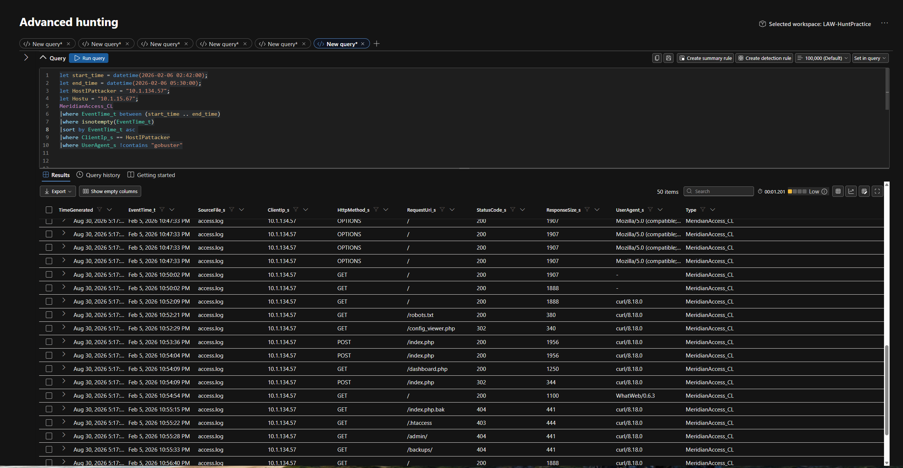

```kusto
// Recon: attacker web requests excluding the gobuster flood
let start_time = datetime(2026-02-06 02:42:00);
let end_time   = datetime(2026-02-06 05:30:00);
let AttackerIP = "10.1.134.57";
MeridianAccess_CL
| where EventTime_t between (start_time .. end_time)
| where isnotempty(EventTime_t)
| sort by EventTime_t asc
| where ClientIp_s == AttackerIP
| where UserAgent_s !contains "gobuster"
```

```kusto
// Derived summary: first seen and request count per tool (not in screenshots; validate in your workspace)
let start_time = datetime(2026-02-06 02:42:00);
let end_time   = datetime(2026-02-07 05:30:00);
let AttackerIP = "10.1.134.57";
MeridianAccess_CL
| where EventTime_t between (start_time .. end_time)
| where ClientIp_s == AttackerIP
| extend Tool = case(
    UserAgent_s has "gobuster", "gobuster",
    UserAgent_s has "WhatWeb",  "WhatWeb",
    UserAgent_s has "curl",     "curl",
    UserAgent_s has "Mozilla",  "Mozilla/5.0 (compatible)",
    "other")
| summarize FirstSeen = min(EventTime_t), Requests = count() by Tool
| sort by FirstSeen asc
```

### 2. Initial access: path traversal (T1190)

`config_viewer.php` was first requested at 10:52:29 PM and returned a 302. Filtering the access log to that endpoint shows the full exploitation chain in just three rows.

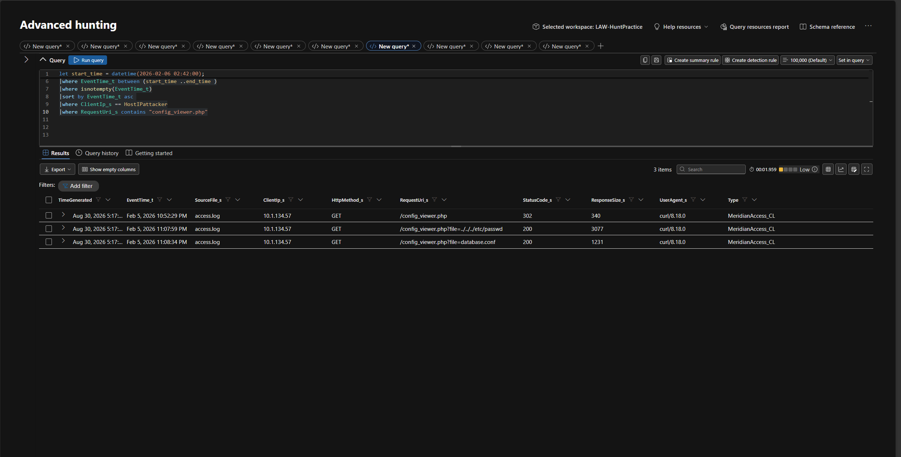

```kusto
// Exploitation: every request to the vulnerable endpoint
let start_time = datetime(2026-02-06 02:42:00);
let end_time   = datetime(2026-02-07 05:30:00);
let AttackerIP = "10.1.134.57";
MeridianAccess_CL
| where EventTime_t between (start_time .. end_time)
| where isnotempty(EventTime_t)
| sort by EventTime_t asc
| where ClientIp_s == AttackerIP
| where RequestUri_s contains "config_viewer.php"
```

| Time | Request | Status | Bytes |
|---|---|---|---|
| 10:52:29 PM | `/config_viewer.php` | 302 | 340 |
| 11:07:59 PM | `/config_viewer.php?file=../../../etc/passwd` | 200 | 3,077 |
| 11:08:34 PM | `/config_viewer.php?file=database.conf` | 200 | 1,231 |

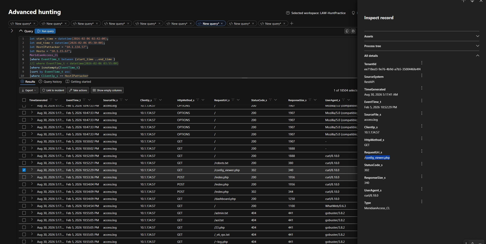

### 3. Credential access and valid account (T1552.001, T1078)

`database.conf` contained credentials. Thirty-five seconds after it was read, `svc_backup` logged in over SSH from the attacker's IP. No new account was created, so the activity looked like a normal service account.

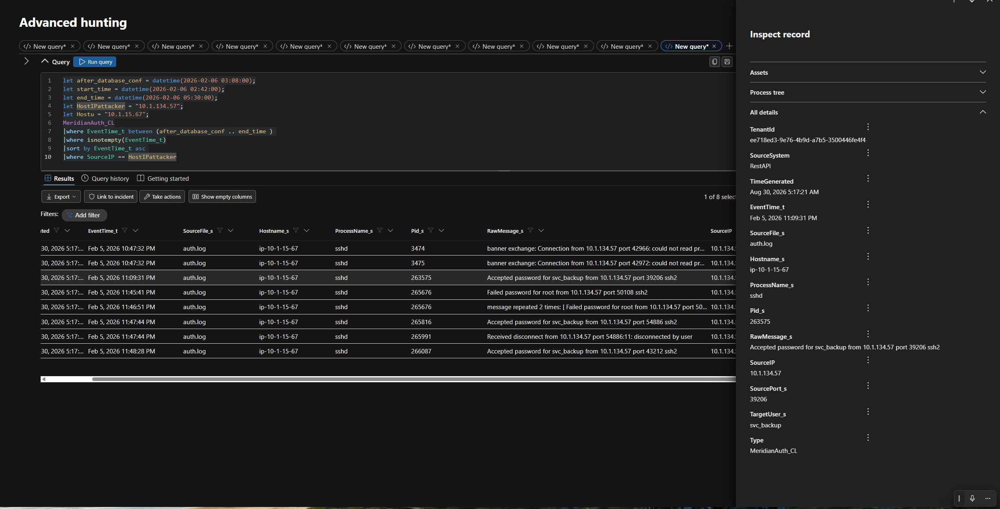

```kusto
// Logins from the attacker after database.conf was read (04:08 UTC = 11:08 PM local)
let after_database_conf = datetime(2026-02-06 04:08:00);
let end_time   = datetime(2026-02-06 05:30:00);
let AttackerIP = "10.1.134.57";
MeridianAuth_CL
| where EventTime_t between (after_database_conf .. end_time)
| where isnotempty(EventTime_t)
| sort by EventTime_t asc
| where SourceIP == AttackerIP
```

### 4. Privilege escalation (T1548.001)

Two routes failed and one worked.

- **Failed:** `sudo` by `svc_backup` was not allowed (11:15 PM), and SSH logins as `root` were rejected from both `10.1.15.67` and the attacker (11:44 to 11:46 PM).
- **Succeeded:** `/tmp/rootbash -p` ran at 11:40:15 PM with file mode `0104755` and uid 0, a setuid root shell. The `-p` flag keeps the elevated privileges.

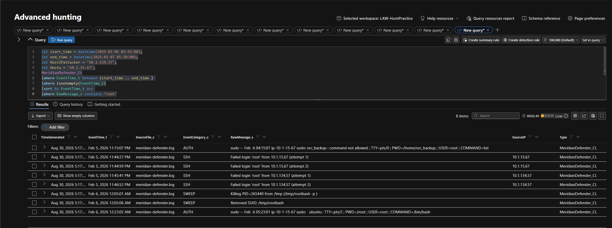

```kusto
// Defender events mentioning root: failed sudo, failed SSH, sweep kill, responder sudo
let start_time = datetime(2026-02-06 02:42:00);
let end_time   = datetime(2026-02-07 05:30:00);
MeridianDefender_CL
| where EventTime_t between (start_time .. end_time)
| where isnotempty(EventTime_t)
| sort by EventTime_t asc
| where RawMessage_s contains "root"
```

```kusto
// Audit trail: process executions with arguments, including /tmp/rootbash -p
let start_time = datetime(2026-02-06 02:42:00);
MeridianAudit_CL
| where EventTime_t > datetime(2026-02-06 03:47:00)
| where isnotempty(EventTime_t)
| sort by EventTime_t asc
| where isnotempty(Argv_s)
```

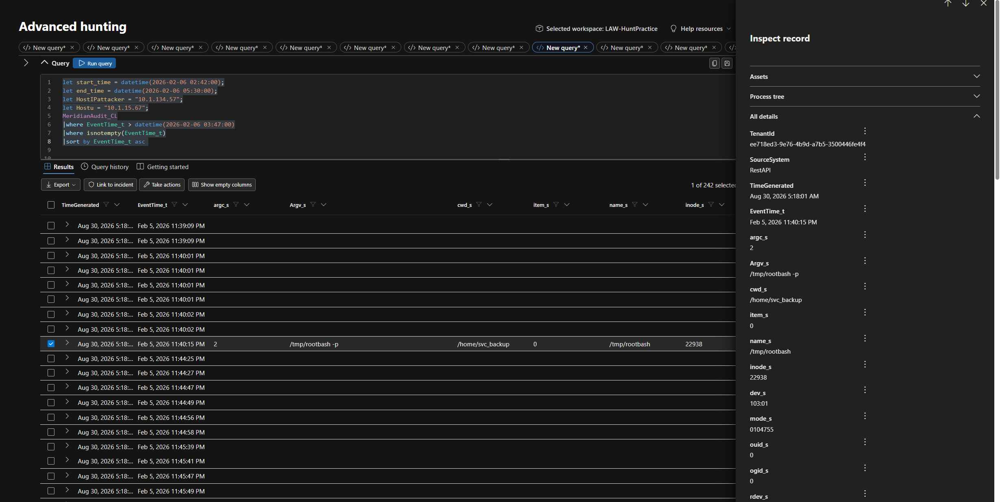

### 5. Persistence and masquerading (T1036.005)

As root, the attacker placed `/opt/meridian/scripts/health_check`, a name chosen to blend in with legitimate monitoring. The 12:30 AM process snapshot shows it running as root with parent PID 1.

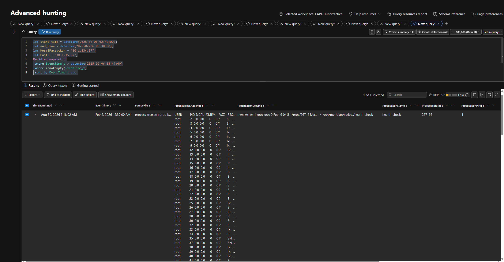

```kusto
// Process snapshot: running beacon, its PID, parent and executable link
MeridianSnapshot_CL
| where EventTime_t > datetime(2026-02-06 03:47:00)
| where isnotempty(EventTime_t)
| sort by EventTime_t asc
| project EventTime_t, ProcBeaconName_s, ProcBeaconPid_s, ProcBeaconPPid_s, ProcBeaconExeLink_s
```

### 6. Why `health_check` survived

The sweep that terminated `rootbash` also recorded `Non-baseline file in scripts/: health_check`. It detected the file but did not terminate the process, which was still running at 12:30 AM.

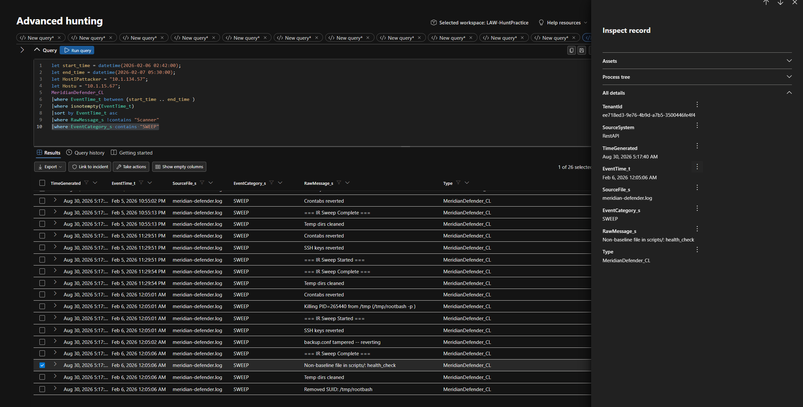

```kusto
// IR sweep actions (excludes the scanner detections)
let start_time = datetime(2026-02-06 02:42:00);
let end_time   = datetime(2026-02-07 05:30:00);
MeridianDefender_CL
| where EventTime_t between (start_time .. end_time)
| where isnotempty(EventTime_t)
| sort by EventTime_t asc
| where RawMessage_s !contains "Scanner"
| where EventCategory_s contains "SWEEP"
```

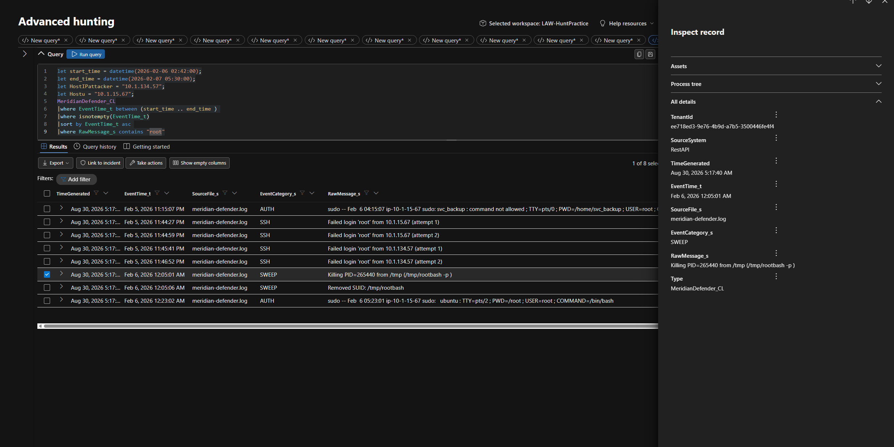

### 7. Command and control (T1071)

The host repeatedly attempted to send data to `10.1.134.57:43212`, and the network control blocked **73 outbound connections**. That proves the traffic is being blocked and that the beacon was live. It does **not** prove the problem is fixed: the process and file remain, and as soon as the block stops the beacon will exfiltrate data.

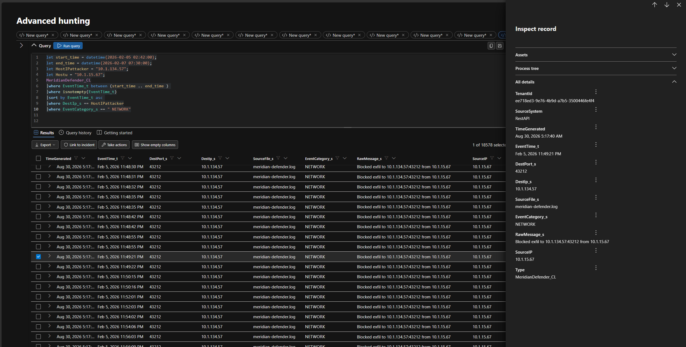

```kusto
// Blocked outbound connections to the attacker's C2 port
let start_time = datetime(2026-02-05 02:42:00);
let end_time   = datetime(2026-02-07 07:30:00);
let AttackerIP = "10.1.134.57";
MeridianDefender_CL
| where EventTime_t between (start_time .. end_time)
| where isnotempty(EventTime_t)
| sort by EventTime_t asc
| where DestIp_s == AttackerIP
| where EventCategory_s == "NETWORK"
```

```kusto
// Derived: blocked-connection volume per hour (not in screenshots; validate in your workspace)
let AttackerIP = "10.1.134.57";
MeridianDefender_CL
| where DestIp_s == AttackerIP and EventCategory_s == "NETWORK"
| summarize BlockedConnections = count() by bin(EventTime_t, 1h)
| sort by EventTime_t asc
```

### 8. Collection and exfiltration (T1213, T1005)

The attacker exfiltrated patient data from the SQL database, searching for patient-related records in the `patients` table. Supporting evidence is the sweep entry `Patient data export from 10.1.134.57` (category `WEB`, 10:56:28 PM) and the MySQL general log, which shows queries against `meridian_patients`.

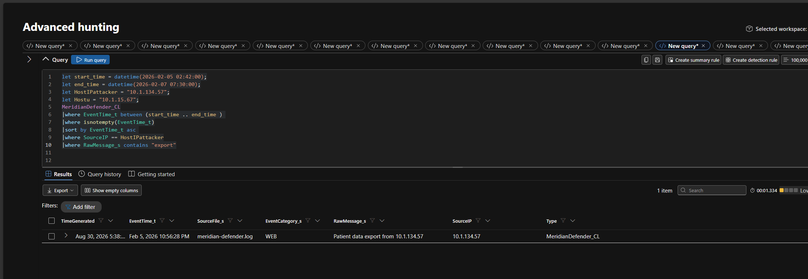

```kusto
// Export events from the attacker IP
let start_time = datetime(2026-02-05 02:42:00);
let end_time   = datetime(2026-02-07 07:30:00);
let AttackerIP = "10.1.134.57";
MeridianDefender_CL
| where EventTime_t between (start_time .. end_time)
| where isnotempty(EventTime_t)
| sort by EventTime_t asc
| where SourceIP == AttackerIP
| where RawMessage_s contains "export"
```

```kusto
// Database activity across the window
let start_time = datetime(2026-02-06 02:42:00);
let end_time   = datetime(2026-02-07 05:30:00);
MeridianMySQL_CL
| where EventTime_t between (start_time .. end_time)
| where isnotempty(EventTime_t)
| sort by EventTime_t asc
```

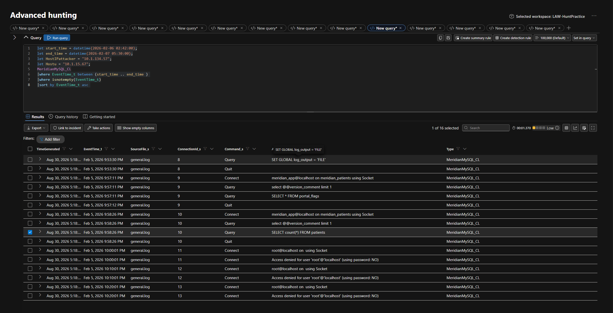

### 9. Integrity impact: `backup.conf` (T1565.001)

The sweep logged `backup.conf tampered -- reverting`, so the attacker modified the file and the sweep reverted it.

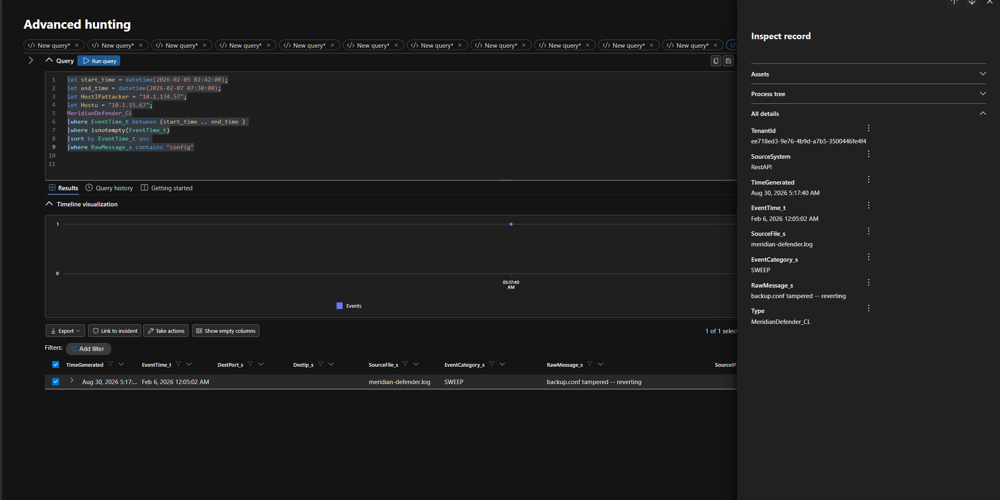

```kusto
// Config file tampering events
let start_time = datetime(2026-02-05 02:42:00);
let end_time   = datetime(2026-02-07 07:30:00);
MeridianDefender_CL
| where EventTime_t between (start_time .. end_time)
| where isnotempty(EventTime_t)
| sort by EventTime_t asc
| where RawMessage_s contains "config"
```

### 10. Collateral damage: Sysmon removed (detection gap)

At 10:08:20 PM the sweep logged `Removed service: sysmon.service`. That is **39 minutes before the attacker's first request**, so process-level Sysmon telemetry was missing for the whole intrusion. Process evidence in this investigation came from the audit log and snapshots instead.

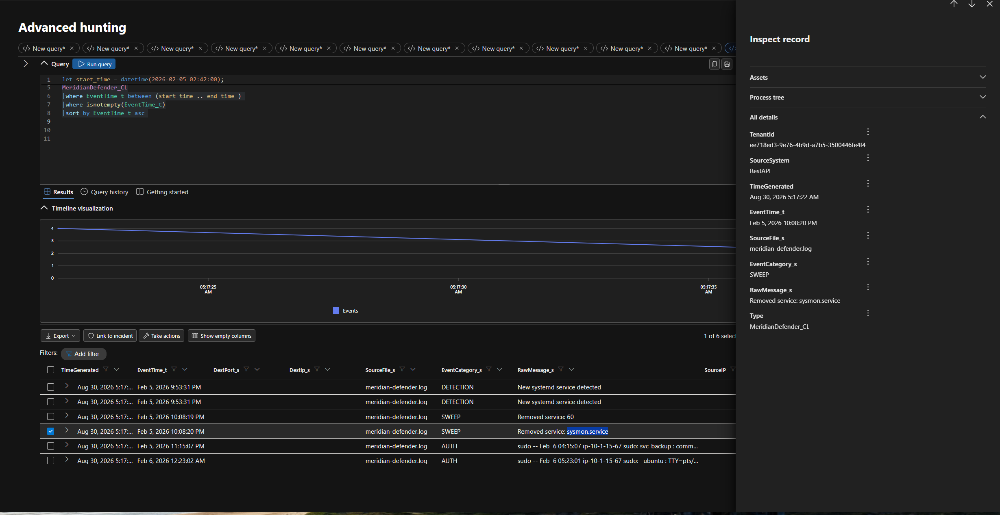

```kusto
// Defender timeline including the pre-attack baseline and the sysmon removal
let start_time = datetime(2026-02-05 02:42:00);
let end_time   = datetime(2026-02-07 07:30:00);
MeridianDefender_CL
| where EventTime_t between (start_time .. end_time)
| where isnotempty(EventTime_t)
| sort by EventTime_t asc
```

### 11. Evidence capture

The audit logs show the root user returning and running AVML (from `/root`, at 12:27:48 and 12:28:24 AM), a memory acquisition tool, which wrote its image to `/tmp/evidence/memory.lime`.

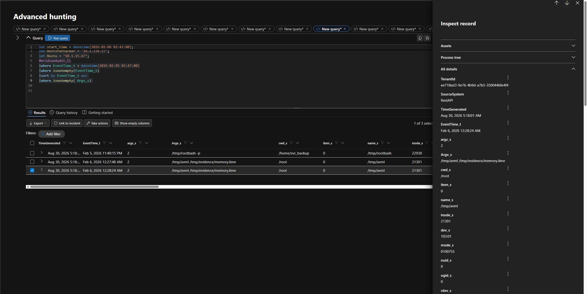

```kusto
// Memory acquisition: avml and the evidence path
let start_time = datetime(2026-02-06 02:42:00);
MeridianAudit_CL
| where EventTime_t > datetime(2026-02-05 03:47:00)
| where isnotempty(EventTime_t)
| sort by EventTime_t asc
| where isnotempty(Argv_s)
| where Argv_s has_any ("avml", "rootbash")
```

---

## MITRE ATT&CK mapping

| Tactic | Technique | Evidence |
|---|---|---|
| Reconnaissance | [T1595 Active Scanning](https://attack.mitre.org/techniques/T1595/) | Mozilla, `curl`, WhatWeb, `gobuster` |
| Initial Access | [T1190 Exploit Public-Facing Application](https://attack.mitre.org/techniques/T1190/) | Traversal in `config_viewer.php` |
| Credential Access | [T1552.001 Credentials In Files](https://attack.mitre.org/techniques/T1552/001/) | `database.conf` read |
| Initial Access, Persistence | [T1078 Valid Accounts](https://attack.mitre.org/techniques/T1078/) | `svc_backup` login |
| Privilege Escalation | [T1548.001 Setuid and Setgid](https://attack.mitre.org/techniques/T1548/001/) | `/tmp/rootbash -p`, mode `0104755` |
| Defense Evasion | [T1036.005 Match Legitimate Name or Location](https://attack.mitre.org/techniques/T1036/005/) | `health_check` in `scripts/` |
| Defense Evasion | [T1036 Masquerading](https://attack.mitre.org/techniques/T1036/) | Beacon posing as a health check |
| Defense Evasion | [T1564.001 Hidden Files and Directories](https://attack.mitre.org/techniques/T1564/001/) | Mapped in the hunt; specific artifact not shown in the evidence |
| Command and Control | [T1071 Application Layer Protocol](https://attack.mitre.org/techniques/T1071/) | Beacon to `10.1.134.57:43212` |
| Collection | [T1213 Data from Information Repositories](https://attack.mitre.org/techniques/T1213/) | Patient data export event |
| Collection | [T1005 Data from Local System](https://attack.mitre.org/techniques/T1005/) | Local config and system files read |
| Impact | [T1565.001 Stored Data Manipulation](https://attack.mitre.org/techniques/T1565/001/) | `backup.conf` tampered |
| Defense Evasion | [T1562.001 Impair Defenses: Disable or Modify Tools](https://attack.mitre.org/techniques/T1562/001/) | `sysmon.service` removed (by the sweep, see finding 10) |

## Indicators of compromise

| Type | Indicator | Note |
|---|---|---|
| IP and port | `10.1.134.57`, `10.1.134.57:43212` | Attacker source and C2 destination |
| User agents | `Mozilla/5.0 (compatible; ...)`, `curl/8.18.0`, `WhatWeb/0.6.3`, `gobuster/3.8.2` | Recon tooling |
| Endpoint | `/config_viewer.php` | Vulnerable to path traversal |
| Request | `?file=../../../etc/passwd`, `?file=database.conf` | Traversal payloads |
| Account | `svc_backup` | Compromised service account |
| File | `/tmp/rootbash` | Setuid root shell, mode `0104755` |
| File and process | `/opt/meridian/scripts/health_check`, PID 267155 | Root beacon |
| File | `backup.conf` | Tampered, reverted by sweep |
| Forensic artifact | `/tmp/avml`, `/tmp/evidence/memory.lime` | Response evidence, not attacker activity |

## Detection and response assessment

| Stage | What happened | Gap |
|---|---|---|
| Recon | 18,504 requests from one IP | No block on scanner user agents |
| Initial access | Traversal returned 200 with sensitive files | No alert on `../` in the request |
| Valid account | `svc_backup` login accepted | No alert on service-account SSH from an external host |
| Root shell | Planted 11:40 PM, blocked 12:09 AM | About 29 minutes of root access before the block |
| `health_check` | Detected, not killed | Alert-only handling left a live root implant |
| C2 | Blocked | Network control only; implant intact |
| Sysmon | Removed at 10:08 PM | Sweep removed a security tool and left no process telemetry |

## Recommendations

1. **Kill `health_check` (PID 267155) and delete the file**, keeping the C2 block in place. Memory is already captured.
2. **Patch `config_viewer.php`**: allow-list readable files, reject `../`, or remove it from production.
3. **Rotate `svc_backup` and database credentials**, and move secrets out of plaintext config files.
4. **Auto-contain non-baseline executables** in script directories instead of alert-only handling.
5. **Mount `/tmp` with `nosuid,noexec`** and alert on setuid bit changes.
6. **Review the sweep playbook** so it never removes security tooling such as `sysmon.service` without a replacement.
7. **Restrict `svc_backup`** to expected source hosts and alert on interactive service-account logins.
8. **Rebuild the host from a known-good image** because the attacker held root.

## Evidence notes

The findings above follow the hunt answers. A few raw log details differ slightly and are noted here for transparency.

- **Rootbash block time:** the findings use 12:09 AM. The sweep log entry for the kill (screenshot 09) is stamped 12:05:01 AM.
- **Blocked connections:** the findings use 73. The query in screenshot 12 returned a larger row count over a wider time window, so the figure depends on the range queried.
- **Patient data:** the exfiltration finding rests on the SQL database activity and the 10:56:28 PM export event. The `meridian_patients` queries visible in screenshot 13 are stamped before the attack began, so confirm query-level timing before quoting record counts.
- **Hidden-file technique (T1564.001):** mapped in the hunt, but no specific hidden artifact appears in the screenshots.

## Skills demonstrated

- KQL hunting across six custom log tables (filtering, sorting, summarizing, time-window scoping)
- Cross-source correlation: web, auth, audit, process snapshot, database and automated-response logs
- Timeline reconstruction with sub-second timestamps and UTC offset handling
- MITRE ATT&CK mapping and IOC extraction
- Distinguishing attacker activity from baseline noise and from the environment's own response actions
- Writing a findings-first incident report with explicit evidence limits and remediation

## Repository layout

```text
.
├── README.md
├── queries/
│   └── meridian-hunt.kql        # optional: all queries above in one file
└── docs/
    └── screenshots/
        ├── 01-hunt-summary.png
        ├── 02-patient-export.png
        ├── 03-recon-access-log.png
        ├── 04-config-viewer-inspect.png
        ├── 05-traversal-requests.png
        ├── 06-svc-backup-login.png
        ├── 07-privesc-attempts.png
        ├── 08-rootbash-audit.png
        ├── 09-rootbash-killed.png
        ├── 10-health-check-process.png
        ├── 11-health-check-detected.png
        ├── 12-c2-blocked.png
        ├── 13-mysql-activity.png
        ├── 14-backup-conf-reverted.png
        ├── 15-sysmon-removed.png
        └── 16-avml-memory.png
```

## Disclaimer

This repository documents a training exercise. It contains no real organizational or patient data.
